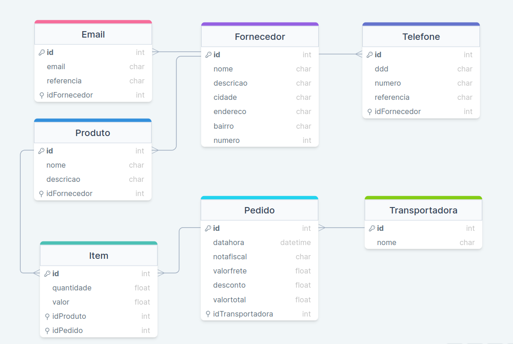

# Backend gerenciador de vendas

Neste repositório contém o backend da aplicação pedida, desenvolvido por [Matheus Marinho](https://www.linkedin.com/in/matheus-marinhodsp/), uma API feita em **node.js**, com um banco de dados **MYSQL** utilizando a arquitetura **MSC** feito com **Sequelize**, e utilizando **Joi** para validar os dados recebidos da requisição e tratar os eventuais erros de tipo.

# Estrutura do banco de dados
